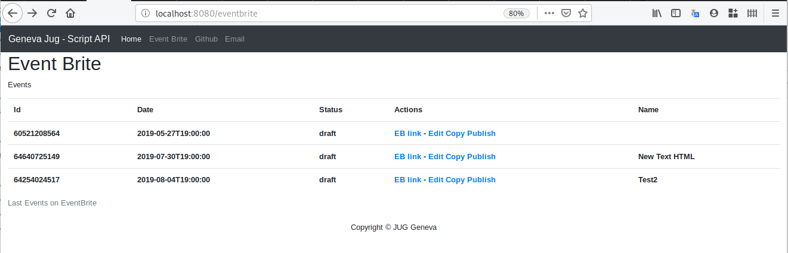
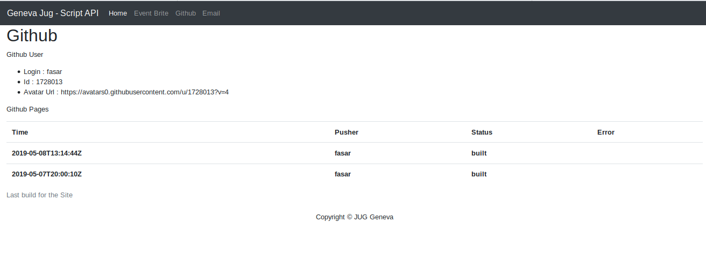
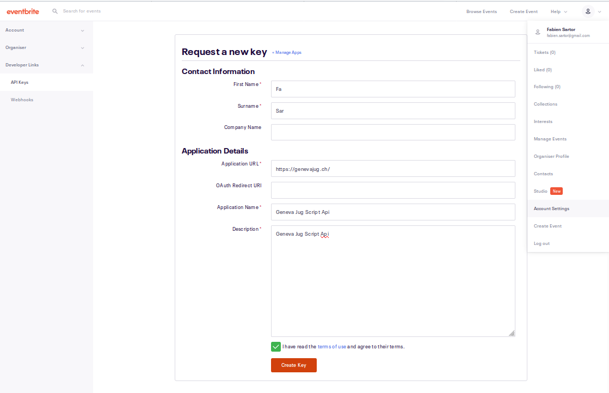
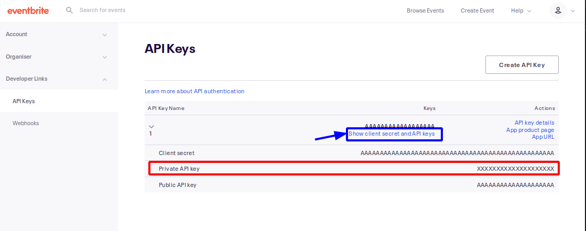
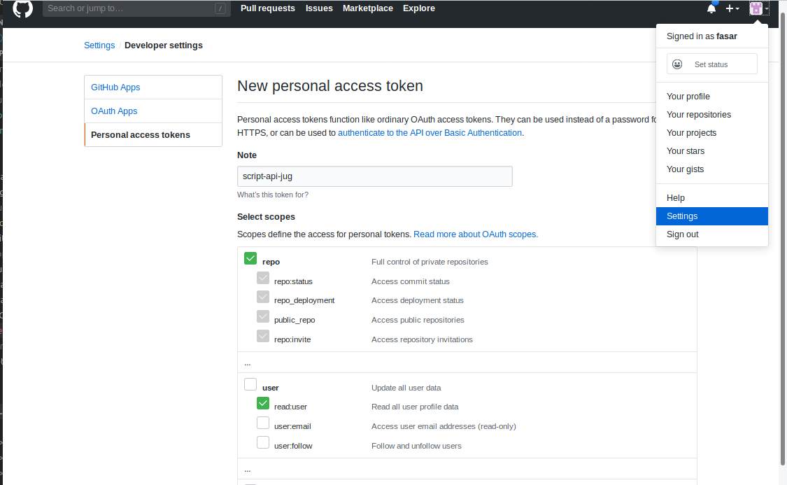

# Geneva Java User Group Script Api

This application aims to manage events in EventBrite with the EventBrite's API.
It lets user to copy old event, edit it and publish it.

To be as fast as possible to dev, I did it in Spring with Feign rest client and thymeleaf.
A second pass should move this application in full client side javascript.

It is my first application in Kotlin. I just wanted to know how it works.
Do not hesitate to leave e comments.

## Run the application

This application is a spring boot application :

* run  `./gradlew bootRun` to start the application
* run  `./gradlew bootJar` to create a fat jar in build/libs/


## EventBrite Overview

The EventBrite page gives you the last events published :



You can edit, copy, publish or unpublish an event.

The process is to:
* copy the last event,
* edit *name* in HTML, the *summary* in HTML, *start date/time* and *end date/time*,
* publish it

If you want more advanced features, use the **EB Link**, you will be ble to modify the event with the eventbrite web site. 

## Github Overview

The Github page gives you the last build process of your site :




## Configuring the application

To configure the application you need to put a properties or yaml file in the root folder.

The properties file look like:

```properties
config.github.token=aaaaaaaaaaaaaaaaaaaaaaaaaaaaaaaaaaaaaaaa
config.github.owner=GenevaJUG
config.github.repo=genevajug.github.io

config.eventbrite.token=AAAAAAAAAAAAAAAAAAAA
# Java jug organisation id is 21041534876
config.eventbrite.organizationId=21041534876

```


## EventBrite Token

* Go to Account Settings > Developer Links > Api Keys >

* Create a new token



* In Api Keys, click on **show client secret and API keys** 



## Github Token

* Go to Github > User Settings > Developer settings > Personal access tokens >

* Create a new token.




